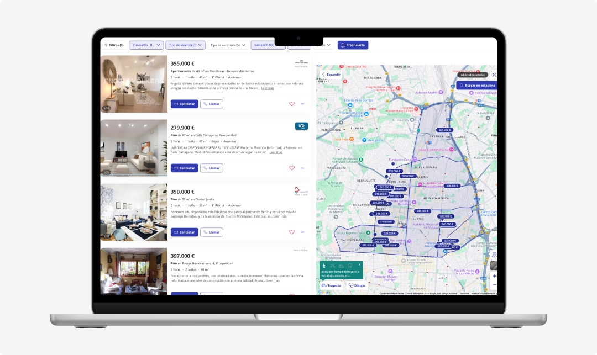

# Fotocasa Scraper 🏠

Este proyecto es un script en Python que utiliza **BeautifulSoup** y **Selenium** para extraer información de propiedades en venta publicadas en [Fotocasa](https://www.fotocasa.es/). El objetivo es obtener datos clave de los anuncios, como título, precio, ubicación, superficie, número de habitaciones, número de baños y enlace al anuncio, y almacenarlos en un archivo CSV.

El código actualmente opera en un archivo HTML descargado para pruebas de scraping, y hay una versión adaptada para combinar Selenium y BeautifulSoup que permite automatizar la navegación y capturar contenido dinámico.



## Características

- **Automatización de la navegación**: Interacción con la página mediante Selenium para manejar contenido dinámico y simulación de scroll.
- **Extracción de datos**: Análisis del DOM con BeautifulSoup para capturar:
  - Título del anuncio
  - Precio
  - Ubicación
  - Superficie
  - Habitaciones y baños
  - Enlace al anuncio
- **Salida estructurada**: Los datos extraídos se guardan en un archivo CSV.

## Limitaciones y Consideraciones

- **Bloqueos del sitio:**
  - Fotocasa puede bloquear el acceso si detecta un uso automatizado (como scrapers).
  - Posibles soluciones:
    - Usar un **User-Agent** realista para simular un navegador.
    - Implementar pausas aleatorias y un scroll más natural para evitar patrones repetitivos.
    - Alternar direcciones IP utilizando una VPN o un servicio de proxies.
- **Tiempos de carga:**
  - Dependiendo de la conexión a internet, la página puede tardar en cargar todos los anuncios al hacer scroll.
  - El script incluye pausas dinámicas para asegurar que los elementos del DOM estén completamente cargados antes de analizarlos.
- **Actualizaciones dinámicas:**
  - El script funciona correctamente en la estructura actual de Fotocasa. Si cambian las clases o elementos HTML, será necesario actualizar el código.
- **Compatibilidad con versiones de Chrome y ChromeDriver:**
  - Es fundamental que las versiones de Google Chrome y ChromeDriver sean compatibles. Recomendamos verificar las versiones instaladas ejecutando:
    ```bash
    google-chrome --version
    chromedriver --version
    ```
    - Si las versiones no coinciden, descarga la versión adecuada de ChromeDriver desde [aquí](https://googlechromelabs.github.io/chrome-for-testing/).
  - Para sistemas macOS, asegúrate de otorgar permisos a `chromedriver` en "Seguridad y Privacidad" si aparece un error de verificación de software malicioso.
- **Configuraciones adicionales:**
  - Si ejecutas el script en GitHub Actions, asegúrate de tener configurada la ruta de `chromedriver` y `google-chrome` correctamente.
  - Hemos añadido configuraciones específicas para evitar bloqueos del sitio, como pausas aleatorias y scrolls naturales.
- **Uso responsable:**
  - Este script es para fines educativos y personales. Asegúrate de cumplir con los términos de uso de Fotocasa.

## Requisitos

- **Python** 3.10 o superior
- **Google Chrome:** Asegúrate de tener instalado Google Chrome.
- **ChromeDriver:** Debes descargar e instalar la versión correcta de ChromeDriver que coincida con tu versión de Chrome. Para sistemas Unix/macOS, recomendamos mover el binario de `chromedriver` a `/usr/local/bin`:
  ```bash
  sudo mv chromedriver /usr/local/bin/chromedriver
  ```
  - Verifica que ChromeDriver esté instalado correctamente:
    ```bash
    chromedriver --version
    ```
- **Librerías necesarias**:
  ```bash
  pip install -r requirements.txt
  ```

## Estructura del Proyecto

```plaintext
fotocasa-scraper/
├── .github/
│   └── workflows/
│       └── main.yml         # Configuración para GitHub Actions
├── main.py                  # Script principal (Selenium y BeautifulSoup)
├── requirements.txt         # Dependencias del proyecto
├── data
|   ├── fotocasa_sample.csv   # CSV de ejemplo
|   └── pisos_fotocasa.csv    # CSV original
└── README.md                 # Documentación del proyecto
```

## Ejecución del script en local

1. **Activa el entorno virtual:**

```bash
source .venv/bin/activate
```

2. **Configuración de dependencias:**

```bash
pip install -r requirements.txt
```

3. **Verifica que chromedriver está configurado:**

```bash
chromedriver --version
```

4. **Ejecuta el script:**

```bash
python main.py
```

El script:

- Acepta cookies automáticamente.
- Realiza un scroll simulado para cargar todos los anuncios.
- Navega por las páginas hasta que no haya más resultados.
- Guarda los datos extraídos en un archivo CSV (`pisos_fotocasa.csv`).

## Datos de Ejemplo

En la carpeta `data` encontrarás un archivo CSV de ejemplo (`fotocasa_sample.csv`) con tres viviendas extraídas de la página de Fotocasa. Este archivo está incluido para mostrar el formato de los datos generados por el script.

### Notas:

- El archivo `fotocasa_sample.csv` de la carpeta `data` no se actualiza automáticamente.
- Los datos del archivo son ficticios y solo se incluyen como referencia del resultado esperado al ejecutar el script.

## Automatización en PythonAnywhere

#### **Configuración inicial:**

1. **Regístrate y configura tu cuenta:**

   - Crea una cuenta en [PythonAnywhere](https://www.pythonanywhere.com).

2. **Sube el proyecto:**

   - Ve a la sección **Files** y sube tus archivos (`main.py`, `requirements.txt`, etc.).

3. **Instala las dependencias:**
   - Abre el terminal en PythonAnywhere y ejecuta:
     ```bash
     pip install -r requirements.txt --user
     ```

#### **Configura una tarea programada:**

1. En PythonAnywhere, ve a la sección **Tasks**.
2. Crea una nueva tarea y establece la periodicidad, por ejemplo, cada lunes a las 9:00 AM.
3. Introduce el comando para ejecutar tu script:
   ```bash
   python /home/tu_usuario/main.py
   ```

#### **Ventajas de PythonAnywhere:**

- El script se ejecuta incluso si tu ordenador está apagado.
- Evitas bloqueos por IP al usar la IP del servidor de PythonAnywhere.
- Puedes acceder y supervisar el proyecto desde cualquier lugar.

## **Enlaces de Referencia**

- 🔗 [Documentación de Selenium](https://www.selenium.dev/documentation/)
- 🔗 [Documentación de BeautifulSoup](https://www.crummy.com/software/BeautifulSoup/bs4/doc/)
- 🔗 [Descargar ChromeDriver](https://developer.chrome.com/docs/chromedriver/downloads?hl=es-419)

## Nota Importante

> Este proyecto es de uso personal y educativo. Fotocasa puede bloquear el acceso a su sitio si detecta patrones automatizados. Asegúrate de respetar los términos de uso del sitio.
